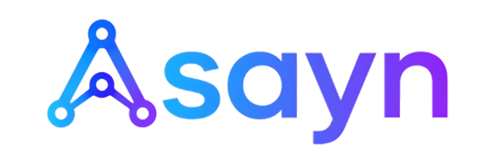

# Asayn

<p align="center">
  
</p>

中文 | [English](README.md)

**Asayn = agent skills are all you need.**

Asayn 是一个受 Claude Code 启发的 Go 终端智能体。它提供 Bubble Tea TUI、兼容 OpenAI Chat Completions 的模型接入、按工作区保存的会话、可配置的 root/sub agents、skills、MCP 工具、shell 执行和自动上下文压缩。

## 目录

- [安装](#安装)
- [快速开始](#快速开始)
- [目录与文件](#目录与文件)
- [配置](#配置)
- [命令](#命令)
- [工具能力](#工具能力)
- [从源码构建](#从源码构建)

## 安装

### 桌面 GUI

从 [GitHub Releases](https://github.com/daife/Asayn/releases/latest) 下载最新桌面安装包。GUI 已内置本地 Go Agent 引擎，不需要另外安装 CLI。

Asayn 发布两种桌面版本：

- **Tauri 桌面版**：默认推荐，安装包更小。它使用系统自带的 WebView/WebKit runtime，适合大多数用户。
- **Electron 桌面版**：文件名为 `Asayn-Electron-*` 的兜底版本。它内置 Chromium，因此体积更大，但可以避免部分设备缺少 WebView runtime、或不同 WebView 版本导致的不可预测问题。

如果 Tauri 版本出现黑屏、WebView 渲染异常，或者目标设备没有可靠的 WebView runtime，请改用 Electron 版本。

#### Windows x64

下载并运行以下任一文件：

- `Asayn_*_x64-setup.exe`：推荐使用的 NSIS 安装程序。
- `Asayn_*_x64_en-US.msi`：适合统一部署或手动安装的 MSI 安装包。
- `Asayn-Electron-*-windows-x64.exe` / `.msi`：Electron 兜底安装包，适合 WebView 有问题的机器。

安装后从开始菜单启动 **Asayn**，点击 **Open workspace** 选择项目目录。首次启动时，GUI 会和 CLI 一样创建 `~/.Asayn/` 全局默认配置以及工作区 `.Asayn/` 状态。需要在 `~/.Asayn/api_config.toml` 中配置 Provider 和 API key；也可以通过 GUI 的 Agent 设置打开该配置文件。设置面板中也提供和一键安装脚本一致的 Claude Code skills 与 MCP 迁移入口。

#### Linux x64

从最新 Release 中选择 Tauri 版 DEB 或 AppImage：

```bash
# Debian / Ubuntu
sudo apt install ./Asayn_*_amd64.deb

# 便携 AppImage
chmod +x Asayn_*_amd64.AppImage
./Asayn_*_amd64.AppImage
```

Electron 兜底包也会同时发布：`Asayn-Electron-*-linux-x86_64.AppImage` 和 `Asayn-Electron-*-linux-amd64.deb`。当系统 WebKit/WebView 缺失或表现不稳定时，请使用 Electron 版本。

桌面版目前同时提供 Tauri 与 Electron 的 Windows x64、Linux x64 安装包。macOS 用户可以使用 CLI release asset，或从源码构建桌面应用。

GUI 与 CLI 共用 `~/.Asayn/` 下的配置，包括 Providers、Agents、Skills、MCP servers、用量数据和工作区会话索引。

### 终端 CLI

#### Linux

```bash
curl -sSL https://raw.githubusercontent.com/daife/Asayn/main/install.sh | bash
```

Linux 安装脚本会下载最新 GitHub release，把 `asayn` 安装到 `~/.local/bin`，必要时更新 shell PATH，并可选择迁移 Claude Code 的 skills 和 MCP server 配置。

#### Windows PowerShell

```powershell
Invoke-WebRequest -Uri "https://raw.githubusercontent.com/daife/Asayn/main/install.ps1" -OutFile install.ps1 && .\install.ps1
```

也可以使用 batch 包装脚本：

```cmd
curl -o install.bat https://raw.githubusercontent.com/daife/Asayn/main/install.bat && install.bat
```

Windows 安装脚本会把 `asayn.exe` 安装到 `%USERPROFILE%\.local\bin`，更新用户 PATH，并可执行同样的 Claude Code 迁移流程。目前 release 提供 Windows amd64 二进制文件。

#### macOS

Release 中包含 `asayn-darwin-amd64` 和 `asayn-darwin-arm64`。当前 `install.sh` 实际下载 Linux 产物，因此 macOS 请手动下载对应 release asset，或从源码构建。

#### Claude Code 迁移

Linux 和 Windows 安装脚本可以扫描常见 Claude Code 位置中的 skills 和 MCP server 配置。脚本会把发现的每个 skill 或 MCP server 显示为独立编号；重复项会标记并跳过。选中的 skills 会复制到 `~/.Asayn/skills/`，选中的 MCP servers 会写成 `~/.Asayn/mcp/` 下的独立 JSON 文件。

## 快速开始

使用 GUI 时，启动 **Asayn**，点击 **Open workspace**，然后选择需要 Agent 操作的项目目录。

使用终端客户端时：

```bash
cd /path/to/your/project
asayn
```

首次运行时，Asayn 会在 `~/.Asayn/` 创建全局默认配置，并在 `<project>/.Asayn/` 创建工作区状态。先编辑 `~/.Asayn/api_config.toml`，填入所用 provider 的 API key，然后在 TUI 中开始使用。

## 目录与文件

全局配置：

```text
~/.Asayn/
  api_config.toml
  root_agents/
  sub_agents/
  special_agents/
  skills/
  mcp/
  usage.jsonl
```

工作区状态：

```text
<workspace>/.Asayn/
  .sessions/
    root_agents/
    sub_agents/
    special_agents/
```

Asayn 会把仓库中的 `default_Asayn/` 嵌入二进制文件。启动时，缺失的默认文件会复制到 `~/.Asayn/`，但不会覆盖已有文件。工作区 `.Asayn/` 用于保存会话；如果工作区已有 `.gitignore`，Asayn 会在其中追加 `.Asayn/`，已存在则不会重复添加。

## 配置

### API Provider

编辑 `~/.Asayn/api_config.toml`：

```toml
[providers.DeepSeek]
url = "https://api.deepseek.com"
api_key = "your_api_key"
timeout_seconds = 120
allowed_models = [
  "deepseek-v4-pro",
  "deepseek-v4-flash"
]
```

内置默认配置包含 DeepSeek、SiliconFlow 和 XiaomiMIMO 示例。Provider URL 按兼容 OpenAI Chat Completions 的接口处理；如果配置的 URL 不是以 `/chat/completions` 结尾，Asayn 会自动追加。

### Agent

Agent 配置位置：

```text
~/.Asayn/root_agents/*.toml
~/.Asayn/sub_agents/*.toml
~/.Asayn/special_agents/*.toml
<workspace>/.Asayn/root_agents/*.toml
<workspace>/.Asayn/sub_agents/*.toml
<workspace>/.Asayn/special_agents/*.toml
```

Root agent 负责主会话。Sub-agent 用基础工具集执行委派任务。`special_agents/compact_agent.toml` 用于 `/compact` 和自动上下文压缩。

同名时，工作区 agent 配置优先于全局配置。如果 `/model_config` 保存的配置在工作区中尚不存在，则会写入全局配置位置。

常用字段包括 `provider`、`model`、`system_prompt`、`visible_skills`、`visible_mcp`、`max_output_lines`、`allow_parallel_shell`、`allow_interactive_shell`、`thinking_enabled`、`reasoning_effort` 和 `auto_compact_threshold_percent`。

### Skills

Skill 是包含 `SKILL.md` 的目录包：

```text
~/.Asayn/skills/<skill-name>/SKILL.md
<workspace>/.Asayn/skills/<skill-name>/SKILL.md
```

同名时，工作区 skill 会覆盖全局 skill。使用 `/model_config` 为每个 agent 选择可见 skills。

### MCP

MCP server 配置是 `~/.Asayn/mcp/` 或 `<workspace>/.Asayn/mcp/` 下的 JSON 文件。同名时，工作区 MCP 配置会覆盖全局配置。可在 `/model_config` 中按 agent 启用可见 MCP。

```json
{
  "mcpServers": {
    "codegraph": {
      "type": "stdio",
      "command": "codegraph",
      "args": ["serve", "--mcp"]
    },
    "remote-docs": {
      "type": "streamable_http",
      "url": "https://example.com/mcp",
      "headers": {
        "Authorization": "Bearer ${MCP_TOKEN}"
      }
    }
  }
}
```

支持的 transport 名称包括 `stdio`、`streamable_http`，以及作为 streamable HTTP 别名的 `http`。

## 命令

在 TUI 中输入 `/` 可查看模糊匹配的命令建议。`Tab` 补全选中的命令。没有命令建议时，上下方向键用于浏览输入历史。

| 命令 | 说明 |
| --- | --- |
| `/help` | 显示帮助 |
| `/new [name]` | 新建会话 |
| `/resume [session]` | 选择或恢复已保存会话 |
| `/retry` | 重试上一条用户请求 |
| `/rename [name]` | 重命名当前会话 |
| `/fork [name]` | 从当前点复制会话 |
| `/root_agent [name]` | 选择或设置 root agent |
| `/model [name]` | `/root_agent` 的别名 |
| `/model_config` | 配置模型、thinking、shell、skills、MCP |
| `/compact` | 使用 `compact_agent` 压缩上下文 |
| `/btw <question>` | 预留命令，当前未实现 |
| `/exit` | 退出 CLI |

Agent 正在工作时，按 Enter 会把当前输入加入队列。按 Esc 会取消最后一条队列消息；如果队列为空，则中断当前回合。

在 Windows 上，`/model_config` 和 GUI 的 Agent 设置中会为 root agent 提供 **Git Bash** shell 选项。强烈建议开启 Git Bash——模型通常比 PowerShell 更擅长使用 bash shell 命令。开启时，Asayn 会检查 Git Bash 是否安装在默认路径 `C:\Program Files\Git\bin\bash.exe`；如果未找到，会拒绝开启并提示从 <https://git-scm.com/download/win> 使用默认设置安装 Git for Windows。开启成功后，暴露给模型的 shell 工具会描述为 Git Bash command，并通过 Git Bash 执行，而不是 PowerShell。

## 工具能力

内置 agent 工具包括：

- 工作区文件读取、目录浏览和正则搜索。
- 读取可见 skills。
- 同步 shell 命令。
- 在 agent 配置中启用后，可使用异步和交互式 shell 命令。
- Sub-agent 列表、异步启动、检查、恢复和 delay。
- 从已启用 MCP server 中发现的可见 MCP 工具。

Sub-agent 使用基础 executor：文件/搜索/skill/同步 shell 以及可见 MCP，不包含 root agent 的 sub-agent 编排工具。

## 从源码构建

### 桌面应用（Tauri 2 与 Electron）

可选桌面客户端位于 `desktop/`。界面使用 React 和 TypeScript，Agent 引擎仍由打包后的 Go sidecar 提供，因此 CLI 与桌面端共用会话、工具、Skills、MCP 和模型配置实现。

Tauri 与 Electron 版本共用同一套 React UI，只是桌面 runtime 与打包方式不同。

```bash
cd desktop
npm install
npm run tauri dev
```

构建 Tauri 桌面安装包：

```bash
cd desktop
npm run tauri build
```

构建 Electron 兜底安装包：

```bash
cd desktop
npm run build:electron -- --win nsis msi --x64
npm run build:electron -- --linux AppImage deb --x64
```

平台依赖及发布构建方式见 `desktop/README.md`。

### 终端应用

要求：

- Go 1.24 或更新版本。
- Bubble Tea 支持的终端。
- Linux、macOS 或 Windows。其他平台需要设置 `ASAYN_ALLOW_NON_LINUX=1`。

构建：

```bash
go build -o asayn ./cmd/asayn
```

更小的 release 风格二进制文件：

```bash
CGO_ENABLED=0 go build -trimpath -ldflags="-s -w -buildid=" -o asayn ./cmd/asayn
```

交叉编译示例：

```bash
CGO_ENABLED=0 GOOS=linux GOARCH=amd64 go build -trimpath -ldflags="-s -w -buildid=" -o asayn-linux-amd64 ./cmd/asayn
CGO_ENABLED=0 GOOS=darwin GOARCH=arm64 go build -trimpath -ldflags="-s -w -buildid=" -o asayn-darwin-arm64 ./cmd/asayn
CGO_ENABLED=0 GOOS=windows GOARCH=amd64 go build -trimpath -ldflags="-s -w -buildid=" -o asayn-windows-amd64.exe ./cmd/asayn
```

运行测试：

```bash
go test ./...
```
